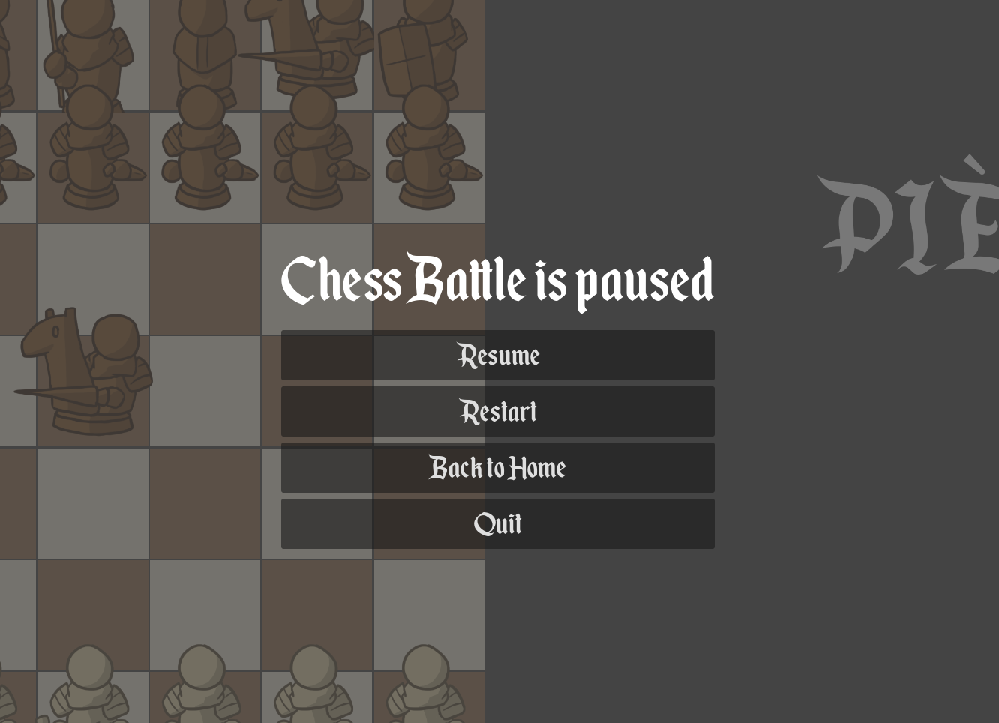
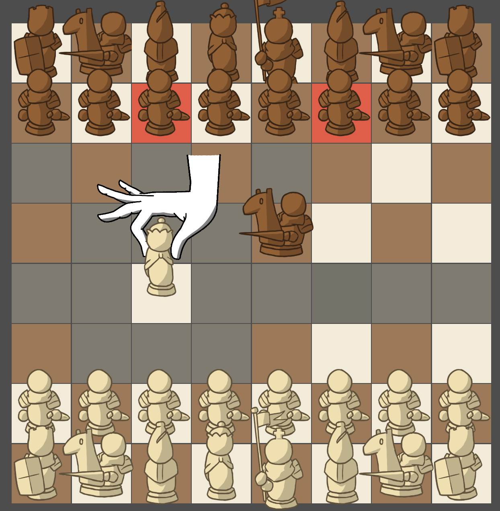
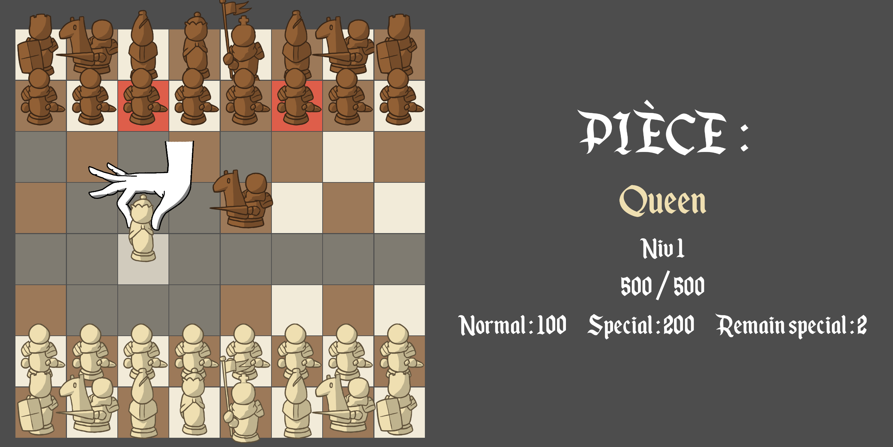
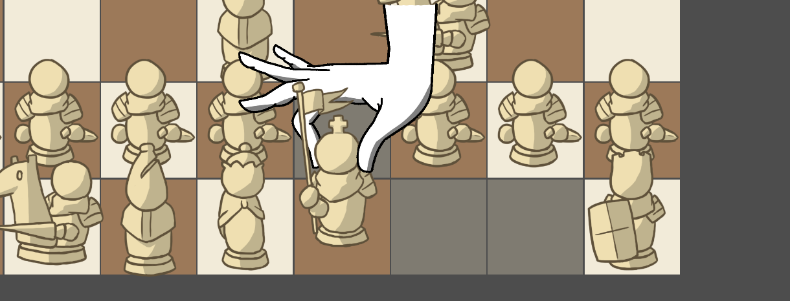
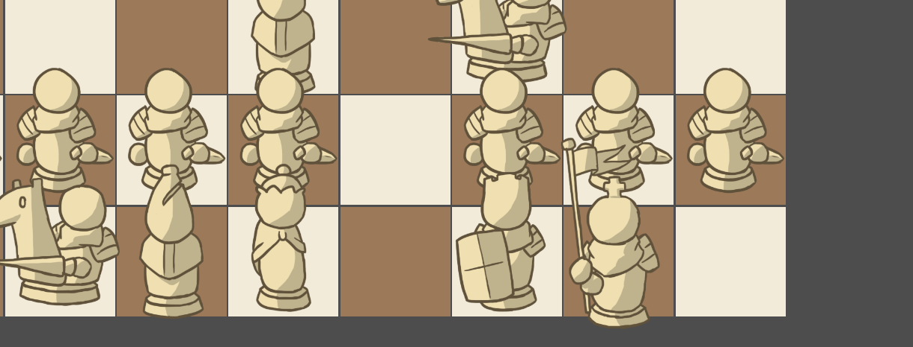
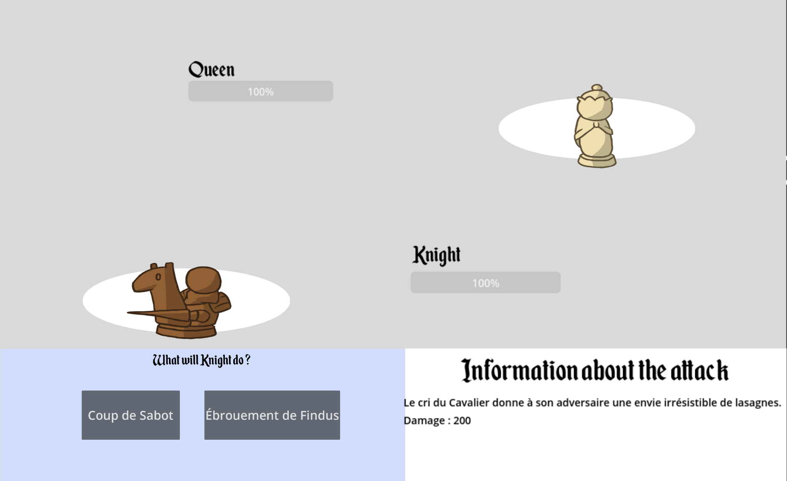
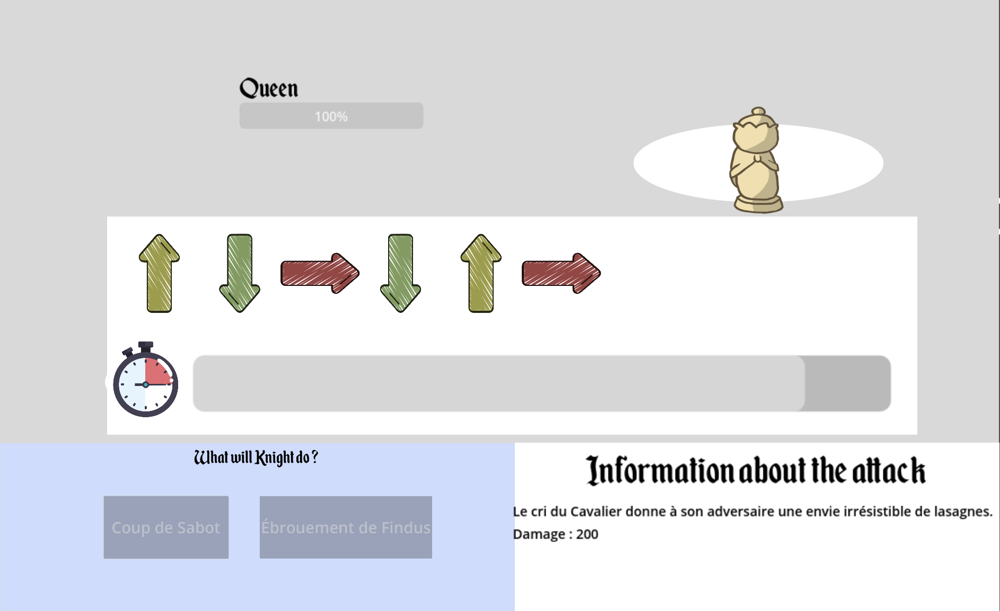
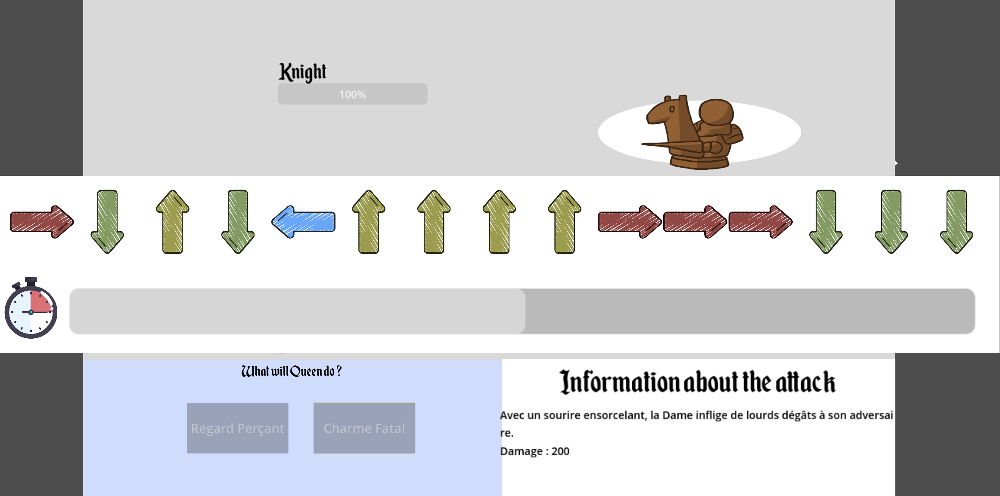

# MR506R - SAE Godot


## Table des matières

- [Introduction](#introduction)
- [Prérequis](#prérequis)
- [Installation](#installation)
- [Utilisation](#utilisation)
	- [Menu principal](#menu-principal)
    - [Menu pause](#menu-pause)
	- [Lancement du jeu](#lancement-du-jeu)
		- [Déplacement](#déplacement)
		- [Combat](#combat)
          - [Attaque Normale](#attaque-normale)
          - [Attaque Spéciale](#attaque-spéciale)
        - [Statistiques des pièces](#statistiques-des-pièces)
- [Auteurs](#auteurs)

## Introduction

Ce projet a été réalisé dans le cadre de l'unité d'enseignement MR506R (SAE) à l'IUT de Reims.
<br />
Il s'agit d'un jeu d'échecs où la particularité réside dans la fonctionnalité "combat".
<br />
En plus des règles classiques du jeu d'échecs, chaque pièce possède des statistiques (points de vie, niveau, attaque normale et attaque spéciale) qui permettent de combattre les pièces adverses.
<br />
Un pion peut donc capturer une dame si cette dernière ne parvient pas à l'attaquer pour que des pièces moins puissantes puissent avoir un rôle déterminant dans une partie.

## Prérequis

- [Godot 4](https://godotengine.org/download/macos/)
- [Bases des échecs](https://fr.wikipedia.org/wiki/R%C3%A8gles_du_jeu_d%27%C3%A9checs)

## Installation

1. Cloner le projet
```
git clone https://github.com/nathanncrt/ChessBattle.git
```
2. Ouvrir le projet avec Godot 4

## Utilisation

### Menu principal

Lorsque vous lancez le jeu, vous arrivez sur le menu principal. Vous avez le choix entre plusieurs options :
- **Start play** : Permet de commencer une nouvelle partie
- **Quit Game** : Permet de quitter le jeu
- **Code source** (lien) : Permet d'accéder au code source du projet
- **Crédits** : liste des auteurs du projet

### Menu pause

Lorsqu'une partie est lancée, vous aurez un nouveau menu avec les options suivantes :
- **Resume** : Permet de reprendre la partie
- **Restart** : Permet de recommencer la partie
- **Back to home** : Permet de revenir au menu principal
- **Quit** : Permet de quitter le jeu
<br/><br/>


### Lancement du jeu

#### Déplacement

Lorsque vous êtes en partie, vous pouvez déplacer une pièce en cliquant simplement dessus.
<br/>
Une main apparaîtra pour vous indiquer que vous avez bien sélectionné la pièce.
<br/>
Les coups possibles seront alors affichés en gris, tandis que les combats seront affichés en rouge.


Lorsque vous cliquez sur l'une des pièces disponibles sur le plateau, vous pouvez voir les statistiques de la pièce en question (points de vie et niveau).
<br/>
Cela permet de prendre une décision plus réfléchie sur le déplacement à effectuer, en fonction des points de vie restants d'une pièce ou de son niveau.


##### Roque et grand roque

Il est possible de réaliser un roque ou un grand roque en cliquant sur le roi, si et seulement si les conditions suivantes sont respectées :
- Le roi n'a pas bougé
- Il n'y a pas de pièce entre le roi et la tour
- Le roi ne peut pas être en échec
- Le roi ne peut pas traverser une case en échec

Si toutes ces conditions sont respectées, vous pouvez réaliser un roque ou un grand roque en cliquant sur le roi.
<br/>
Une case proche de la tour apparaîtra pour vous indiquer que vous pouvez réaliser ce roque.
<br/>
C'est la même chose pour le grand roque, mais avec la tour opposée.





#### Combat

Lorsque vous cliquez sur une pièce ennemie, un combat s'engage.
<br/>
Les statistiques des deux pièces en combat sont affichées, vous permettant de voir les points de vie restants de chaque pièce.
<br/>
Le combat se déroule en plusieurs phases, où chaque pièce attaque à tour de rôle.
<br/>
Chaque pièce a une attaque normale et une attaque spéciale, propre à un nom et une description.
Pour chaque attaque, un pattern de flèches est affiché. Il faut reproduire ce pattern pour réussir l'attaque avec les flèches de son clavier dans le temps imparti.
<br/>
##### Attaque Normale
- Facilement réalisable
- Dégâts modérés selon la pièce
- Un nom et une description liés à la pièce

##### Attaque Spéciale
- Plus difficile à réaliser
- Dégâts élevés
- Un nom et une description liés à la pièce



Voici un exemple d'attaque normale pour un cavalier.


Voici un exemple d'attaque spéciale pour un pion.


##### Statistiques des pièces

Voici les statistiques de chaque pièce :

| Pièce  | Points de Vie  | Attaque Normale | Attaque Spéciale |
|--------|----------------|-----------------|------------------|
| Pawn   | 100            | 30              | 50               |
| Bishop | 250            | 50              | 80               |
| Knight | 200            | 60              | 90               |
| Rook   | 300            | 70              | 100              |
| Queen  | 500            | 100             | 200              |
| King   | 500            | 30              | 50               |


## Auteurs

- [BURLOT Brice](mailto:brice.burlot@etudiant.univ-reims.fr)
- [BOURGASSER Léo](mailto:leo.bourgasser@etudiant.univ-reims.fr)
- [DUNESME Ruben](mailto:ruben.dunesme@etudiant.univ-reims.fr)
- [NICART Nathan](mailto:nathan.nicart@etudiant.univ-reims.fr)
- [PERROT Clément](mailto:clement.perrot@etudiant.univ-reims.fr)
